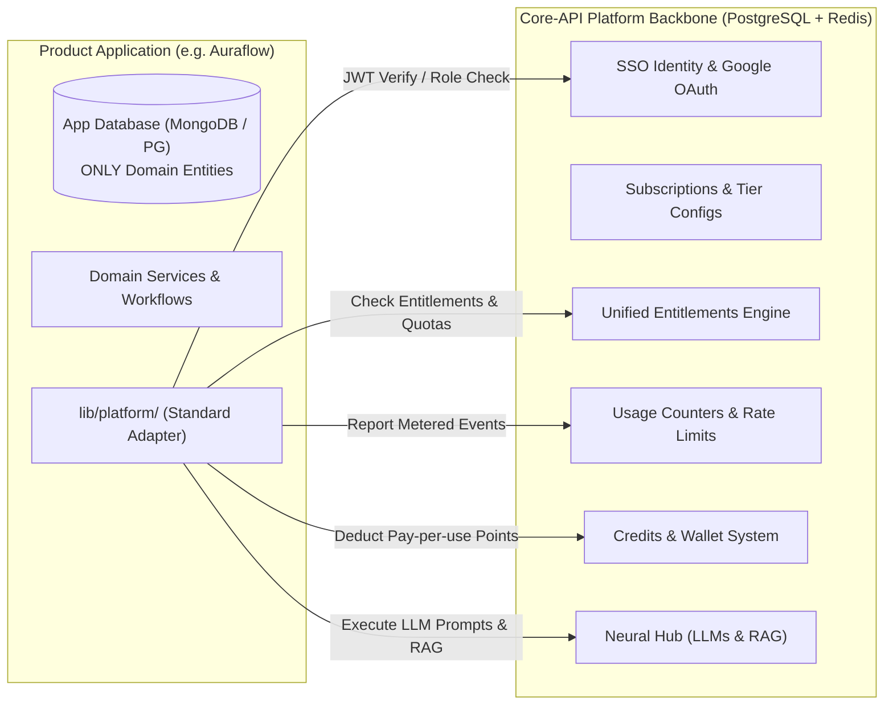

# CodeSwayam Ecosystem — Canonical Reference Architecture Blueprint

> **For Architects & Senior Engineers**: This document specifies the gold standard architecture for connecting any CodeSwayam SaaS product (Auraflow, PDFCraft, PixelForge, EMS, etc.) to the central platform backbone (`core-api`, `codeswayam-auth`, `neural-api`).
>
> Follow this blueprint for all new applications to eliminate duplicate code, guarantee SOLID compliance, and ensure instant scalability.

---

## 1. High-Level Architectural Division: Platform vs Domain Data

The fundamental rule governing every application in the CodeSwayam ecosystem:



### The Strict Boundary:
1. **The Product App owns its Domain Data in its own database**:
   - For Auraflow: Automations, Triggers, Keywords, Flow graphs, Integrations (Instagram accounts & tokens), Conversations, Messages, and Deduplication logs.
   - For PDFCraft: Document templates, generated PDFs, conversion jobs.
   - For PixelForge: Image assets, canvas layers, export history.
   - **Anti-Pattern Warning**: NEVER store subscriptions, plan tiers, credit balances, or duplicate monthly usage counter tables in the app's local database.
2. **Core-API owns all Platform Data in centralized PostgreSQL + Redis**:
   - User identity, emails, passwords, roles (`user`, `admin`, `superadmin`).
   - Razorpay orders, invoices, subscriptions, plan pricing (Free, Standard, Pro, Enterprise).
   - Usage counters (`appUsageCounters`), quota thresholds, and period rollover dates.
   - Credit balances (`userCredits`), point transactions, and feature costs.
   - AI models, platform API keys, and global LLM routing.

---

## 2. Directory Structure Blueprint (Clean Domain Architecture)

Every product application must structure its source code using this clean layout:

```
apps/<app-name>/
├── lib/
│   ├── platform/                       # ★ THE REUSABLE PLATFORM BLUEPRINT
│   │   ├── types.ts                    # Contracts for Session, Entitlements, Quotas
│   │   ├── auth.ts                     # Cryptographic JWT verification (getAuthSession)
│   │   ├── rbac.ts                     # Role-based guards (requireRole, isAdmin)
│   │   ├── entitlements.ts             # Server-side entitlement resolver (checkQuota)
│   │   ├── metering.ts                 # Usage reporter to Core-API (trackPlatformUsage)
│   │   ├── credits.ts                  # Credit check & point deduction facade
│   │   ├── neural.ts                   # Neural AI LLM client facade (PlatformNeuralService)
│   │   ├── sso.ts                      # Centralized login, upgrade, and billing URLs
│   │   └── index.ts                    # Barrel export
│   │
│   ├── domain/                         # ★ DOMAIN BUSINESS LOGIC & STORAGE
│   │   ├── <entity-name>/
│   │   │   ├── <entity>.repository.ts  # Database queries (Prisma/ORM only)
│   │   │   └── <entity>.service.ts     # Business logic & quota validation
│   │   └── webhook/
│   │       ├── webhook-dedup.service.ts # Event deduplication & idempotency
│   │       ├── automation-matcher.ts    # Strategy-based event matching
│   │       └── webhook-processor.service.ts # High-level orchestrator
│   │
│   └── use-<app>-access.ts             # Client hook wrapping @codeswayam/access
│
├── actions/                            # ★ SERVER ACTIONS (Thin controllers)
│   └── <domain>.ts                     # Validates input, calls Domain Service
│
├── components/
│   └── global/
│       └── upgrade-modal.tsx           # Glassmorphism dynamic paywall modal
│
└── app/
    ├── providers/
    │   └── providers.tsx               # Injects CSWProvider + AccessProvider
    └── api/
        └── webhooks/
            └── <provider>/
                └── route.ts            # Thin HTTP controller (no business logic)
```

---

## 3. How to Plug Shared Features into Future Apps in 6 Steps

### Step 1: Wrap App in Providers
In `app/providers/providers.tsx`, wrap children with both `@codeswayam/auth` and `@codeswayam/access`:

```tsx
"use client";

import { CSWProvider } from "@codeswayam/auth";
import { AccessProvider } from "@codeswayam/access";

export function Providers({ children }: { children: React.ReactNode }) {
  const apiUrl = process.env.NEXT_PUBLIC_API_URL || "http://localhost:3000";
  const ssoUrl = process.env.NEXT_PUBLIC_APP_AUTH_URL || "http://localhost:3003";

  return (
    <CSWProvider apiUrl={apiUrl} ssoUrl={ssoUrl}>
      <AccessProvider apiUrl={apiUrl}>
        {children}
      </AccessProvider>
    </CSWProvider>
  );
}
```

### Step 2: Authenticate Server Requests & Actions
In any Server Action or Server Component, import from `lib/platform/auth`:

```typescript
import { getAuthUserId, requireAuthUser } from "@/lib/platform/auth";

export async function myServerAction() {
  const user = await requireAuthUser(); // throws if unauthenticated
  // user.userId, user.email, user.role are cryptographically verified
}
```

### Step 3: Enforce Role-Based Access Control (RBAC)
Protect admin-only actions, pages, or features:

```typescript
import { requireRole, isAdmin } from "@/lib/platform/rbac";

export async function adminOnlyAction() {
  const admin = await requireRole("admin", "superadmin");
  // Guaranteed to have admin privileges
}
```

### Step 4: Enforce Quotas & Entitlements Without Hardcoded Plans
In your Domain Service, check user limits against Core-API before creating resources:

```typescript
import { checkQuota } from "@/lib/platform/entitlements";
import { trackPlatformUsage } from "@/lib/platform/metering";

export async function createDocument(userId: number, data: any) {
  // 1. Check live quota
  const currentCount = await DocumentRepository.countByUserId(userId);
  const quota = await checkQuota("documents", currentCount);

  if (!quota.allowed) {
    return {
      success: false,
      error: `Limit reached (${currentCount}/${quota.limit}). Upgrade to create more.`,
      needsUpgrade: true,
    };
  }

  // 2. Persist domain entity
  const doc = await DocumentRepository.create(userId, data);

  // 3. Report usage asynchronously to Core-API
  trackPlatformUsage("documents", 1, userId, "async").catch(() => null);

  return { success: true, data: doc };
}
```

### Step 5: Integrate AI with Neural Hub & Credit Deductions
When invoking an AI feature (generation, chat, transformation):

```typescript
import { canAffordFeature, deductCredits } from "@/lib/platform/credits";
import { PlatformNeuralService } from "@/lib/platform/neural";
import { trackPlatformUsage } from "@/lib/platform/metering";

export async function generateContent(userId: number, prompt: string) {
  // 1. Verify user has AI included or enough points
  const canAfford = await canAffordFeature(userId, "ai_generation", 10);
  if (!canAfford) {
    return { error: "Insufficient credits. Please top up your wallet." };
  }

  // 2. Execute via Neural Hub
  const reply = await PlatformNeuralService.chat(agentId, prompt, sessionId);

  // 3. Deduct credits & track usage counter
  deductCredits(userId, "ai_generation", "PDFCraft AI Document Summary").catch(() => null);
  trackPlatformUsage("ai_generations", 1, userId, "async").catch(() => null);

  return { success: true, text: reply };
}
```

### Step 6: Present Dynamic Paywalls & Upgrade Modals
When a user hits a plan limit or attempts to access a locked feature:

```tsx
import UpgradeModal from "@/components/global/upgrade-modal";

<UpgradeModal
  isOpen={isOpen}
  onClose={() => setIsOpen(false)}
  title="Document Limit Reached"
  description="Upgrade to Pro for unlimited exports and priority AI summaries."
  targetTier="pro"
  featureName="Unlimited Documents"
/>
```

---

## 4. SOLID Compliance Checklist for New Code

| Principle | Architectural Requirement |
| :--- | :--- |
| **S — Single Responsibility** | Route handlers ONLY handle HTTP. Repositories ONLY execute DB queries. Services ONLY handle business logic. |
| **O — Open / Closed** | Use Strategy Pattern for polymorphic actions (matchers, listeners, exporters). Add new features by adding strategy classes without modifying core loops. |
| **L — Liskov Substitution** | All domain repositories and platform facades must satisfy their interfaces (`IAutomationRepository`, `IEntitlementService`). |
| **I — Interface Segregation** | Avoid passing giant monolithic objects. Pass typed DTOs (`CreateAutomationDto`, `UpdateAutomationDto`). |
| **D — Dependency Inversion** | High-level business logic must depend on abstractions (Services and Repositories), never directly on Prisma client singletons or raw fetch calls. |
